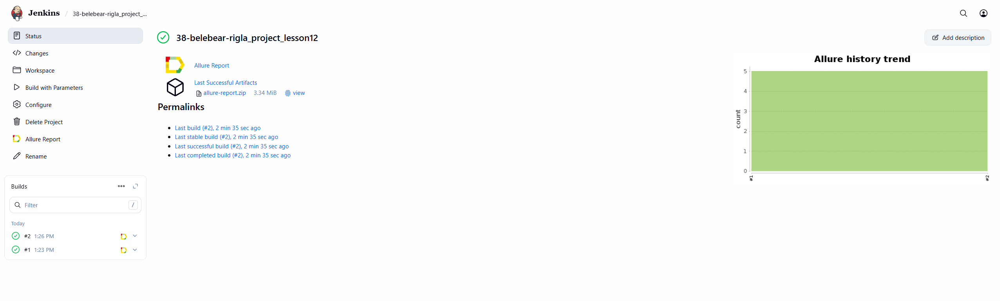
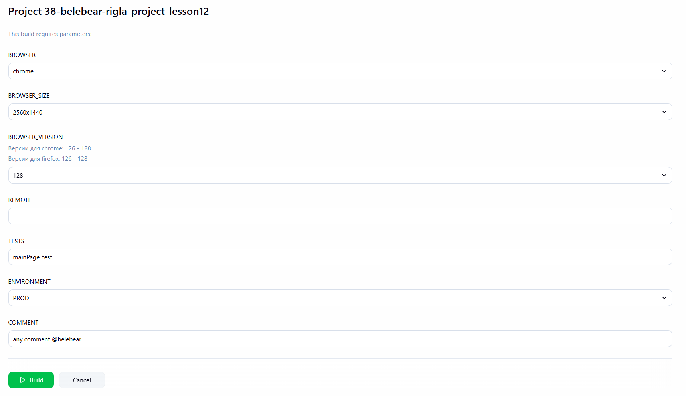
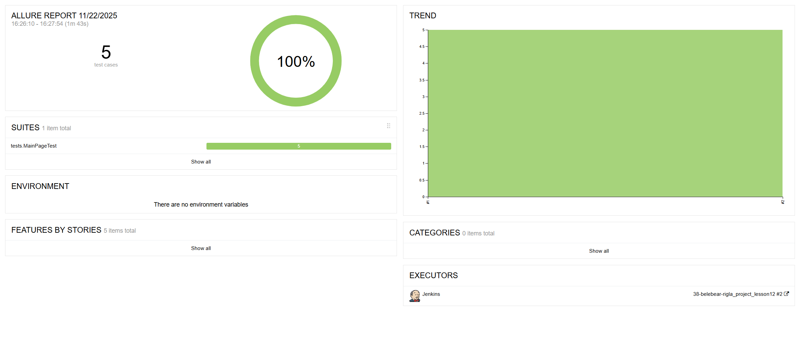
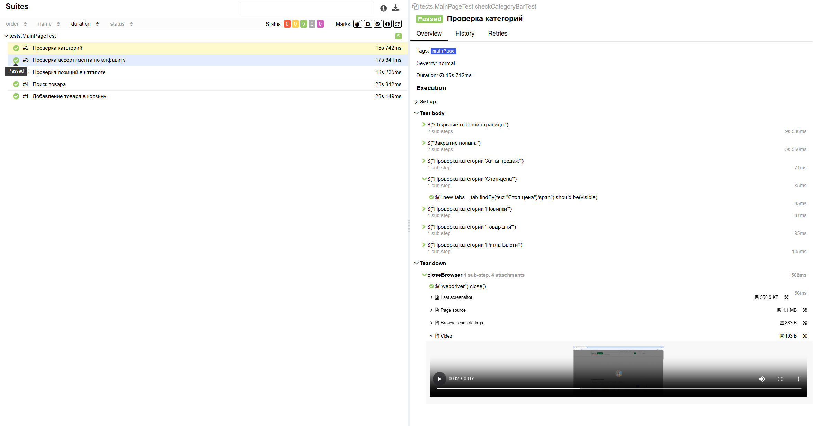
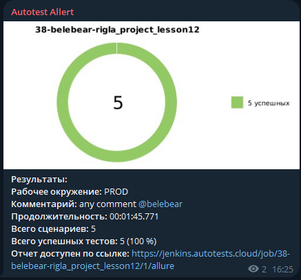
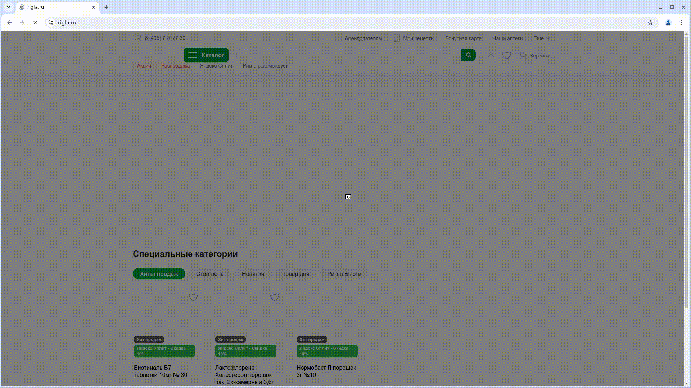

# Автоматизация тестирования [Rigla](https://www.rigla.ru/) 

> «Ригла» — федеральная аптечная сеть, входящая в число крупнейших компаний фармацевтического ритейла России. Является основой розничного сегмента группы компаний «Протек»

## Примеры автоматизированных тест-кейсов:
- Проверка наличия позиций в выпадющем списке 'Каталог'
- Проверка наличия категорий на главной странице
- Проверка ассортимента товаров по алфавиту
- Поиск товара
- Добавление товара в корзину

---

## Запуск тестов через терминал:

#### Для локального запуска
``` bash 
gradle clean mainPage_test
```

#### Для запуска из Jenkins
``` bash 
clean ${TESTS} -Dremote=${REMOTE} -Dbrowser=${BROWSER} -DbrowserSize=${BROWSER_SIZE} -DbrowserVersion=${BROWSER_VERSION}
```

## Сборка в [Jenkins](https://jenkins.autotests.cloud/job/38-belebear-rigla_project_lesson12/) 

<p align="center">  

</p>

### Возможные параметры сборки в Jenkins:

<p align="center">  

</p>

- BROWSER - параметр для выбора браузера
- BROWSER_SIZE - параметр для выбора разрешения, в котором будет открыт браузер
- BROWSER_VERSION - параметр для выбора версии браузера
- REMOTE - параметр для ввода адреса удаленного сервера, где будут выполняться тесты
- TESTS - параметр отвечающий за запуск по тестовой модели
- ENVIRONMENT - выбор окружения, на котором будут запускаться тесты
- COMMENT - параметр, отвечающий за сообщение, которое будет отправлено в телеграм с отчетом

## Отчетность в [Allure](https://jenkins.autotests.cloud/job/38-belebear-rigla_project_lesson12/allure/) 

### Главная страница Allure Reports

<p align="center">  

</p>

### Страница со всеми тест-кейсами и шагами

<p align="center">  

</p>

### По итогу прохождения тестов формируются:
- Скриншоты
- Код страницы
- Видео прохождения теста
- Логи

## Отчетность в Telegram 

### Краткий отчет после прохождения тестов от чат-бота

<p align="center">  

</p>

## Пример видео с выполнением теста
<p align="center">  

</p>
